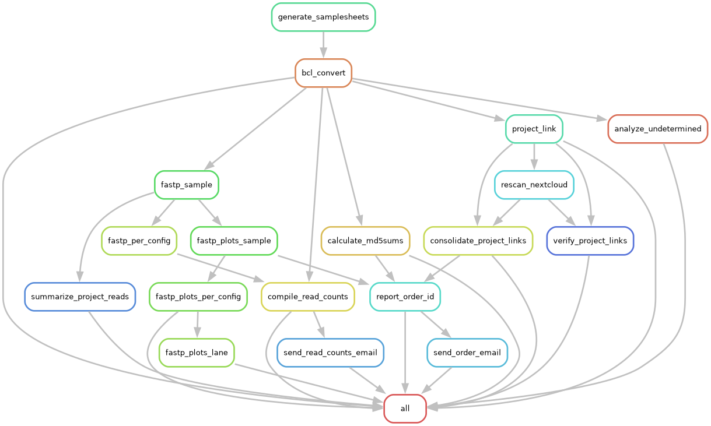

# Snakemake BCL Conversion Pipeline

Automated workflow for NovaSeq data processing, quality control, and report generation.

## Workflow Diagram



## Overview

This Snakemake pipeline handles the complete sequencing data processing workflow:
1. **BCL Conversion** - DRAGEN BCL-to-FASTQ conversion with per-lane sample sheets
2. **File Renaming** - Systematic renaming based on lane, group, position, and barcode
3. **Quality Analysis** - FastP quality metrics for all samples
4. **Visualization** - Quality plots (mean Phred scores, base composition)
5. **Report Generation** - Comprehensive HTML reports grouped by Order ID with embedded plots and download instructions
6. **Read Count Compilation** - Lane-level read counts formatted as CSV, aggregated per library
7. **Email Notifications** - Automated email delivery of reports and read counts

## Key Files

- **`Snakefile`** - Main workflow definition with all rules
- **`snakemake_config.yaml`** - Base configuration (paths, threads, email settings)
- **`snakemake_config_project.yaml`** - Project-specific configuration (overrides base settings)
- **`metadata/*.xlsx`** - Excel metadata with Summary sheet and per-project sheets
- **`src/RunInfo_nn.xml`** - Normalized run configuration (auto-generated)

## Configuration

Edit `snakemake_config.yaml` to customize:

```yaml
library_name: "xR077"                    # Run identifier
metadata: "metadata/251219_23G5F2LT3_10B_PE151_xR077.xlsx"
data_dir: "/staging/nextcloud/NovaseqX/..." # BCL data location
basecalls_path: "/path/to/BaseCalls"    # For lane auto-detection
run_info_path: "src/RunInfo_nn.xml"
fastp_threads: 4
email_sender: "kstachel@uci.edu"
email_recipient: "kstachel@uci.edu"
tiles: ""                                # Optional: specific tiles (e.g., "1_1101")
```

## Metadata Format

The Excel metadata file must contain:
- **Summary sheet** (header at row 3):
  - `Lane`, `Gr` (Group), `Project Name`, `Masking`, `Fastq Link`
- **Per-project sheets** with sample details:
  - `Lane`, `Group`, `Sample Name`, `i7 Barcode Sequence`, `i5 Barcode Sequence`

**Masking format**: `R1:151, I1:8, I2:8, R2:151` → generates OverrideCycles

## Workflow Steps

### 1. Sample Sheet Generation (automatic)
- Parses metadata Excel file
- Generates per-lane/masking sample sheets in `src/SampleSheet_lane{N}_{masking}.csv`
- Creates renaming maps in `src/renaming_map_lane{N}_{masking}.csv`
- Produces Flexbar barcode files for Flexbar-tagged projects

### 2. BCL Conversion
```bash
snakemake --cores 8 output/lane1_R1-151_I1-8_I2-8_R2-151
```
- Runs DRAGEN BCL Convert per lane/masking configuration
- Applies OverrideCycles from metadata masking field
- Creates project subdirectories
- Renames FASTQ files using renaming map: `{Run}-L{Lane}-G{Group}-P{Position}-{Barcode}`

### 3. Quality Analysis (FastP)
```bash
snakemake --cores 4 results/fastp_lane1_R1-151_I1-8_I2-8_R2-151.done
```
- Runs FastP on all samples per config
- Outputs JSON stats to `results/fastp/{config_id}/{project}/{sample}.json`

### 4. Quality Plots
```bash
snakemake --cores 4 results/fastp_plots_lane1_R1-151_I1-8_I2-8_R2-151.done
```
- Generates mean Phred and base composition plots
- Outputs PNG files to `results/fastp_plots/{config_id}/{project}/{sample}-*.png`

### 5. Project/Order Reports
```bash
snakemake --cores 1 Reports/order_12345/index.html
```
- Creates comprehensive HTML reports grouped by `Order ID`
- Includes summary of all projects associated with the order
- Embeds quality plots as base64 images
- Includes download instructions (browser, wget, HPC) and sorted md5 checksums
- Outputs:
  - `Reports/order_{id}/index.html`
  - `Reports/order_{id}/md5sums.txt`
  - `Reports/order_{id}/Download_Instructions.pdf`
  - `Reports/{project}/lane{lane}/index.html`

### 6. Read Count Compilation
```bash
snakemake --cores 1 results/xR077-count.csv
```
- Aggregates read counts across all lanes
- Formats as CSV matching format: lane columns with sample names and counts
- Sorted by read count (descending) per lane

### 7. Email Delivery
```bash
snakemake --cores 1 Reports/xR077_read_counts_email.done
```
- Sends read count CSV as attachment
- Uses SMTP (smtp.uci.edu:25)

## Common Commands

**Dry run (see what would execute):**
```bash
snakemake -n
```

**Run entire workflow:**
```bash
snakemake --cores 8
```

**Run specific project report:**
```bash
snakemake --cores 4 Reports/MyProject/index.html
```

**Analyze undetermined indices:**
```bash
snakemake --cores 1 results/undetermined_indices/lane1_R1-151_I1-8_I2-8_R2-151.csv
```

**Force re-run a specific rule:**
```bash
snakemake --cores 4 -R compile_read_counts
```

**View dependency graph:**
```bash
snakemake --dag | dot -Tpdf > dag.pdf
```

## Output Structure

```
output/
  lane{N}_{masking}/
    {project}/
      {Run}-L{Lane}-G{Group}-P{Position}-{Barcode}-R1.fastq.gz
      {Run}-L{Lane}-G{Group}-P{Position}-{Barcode}-R2.fastq.gz

results/
  fastp/
    lane{N}_{masking}/{project}/{sample}.json
  fastp_plots/
    lane{N}_{masking}/{project}/{sample}-mean_phred.png
    lane{N}_{masking}/{project}/{sample}-base_comp.png
  undetermined_indices/
    lane{N}_{masking}.csv
  {library}-count.csv

Reports/
  order_{id}/
    index.html
    md5sums.txt
    Download_Instructions.pdf
    email_sent.done
  {project}/
    lane{lane}/
      index.html
      md5sums.txt
  {library}_read_counts_email.done
```

## Email Configuration

The workflow uses `src/send_email.py` with support for:
- Plain text or HTML content
- File attachments
- Configurable SMTP settings (default: smtp.uci.edu:25)

For OAuth2 (Gmail):
- Set up Google Cloud OAuth2 credentials
- Store `client_secret.json` and `token.json` in workspace
- Modify `send_email.py` to use `google-auth` libraries
- Set environment variables for credential paths

## Troubleshooting

**Missing lanes in workflow:**
- Check `detected_lanes` output at workflow start
- Verify `basecalls_path` in config points to correct BaseCalls directory

**BCL conversion fails:**
- Verify `data_dir` and `run_info_path` are correct
- Check DRAGEN is available: `which dragen`
- Review OverrideCycles match actual run cycles

**No samples in report:**
- Check metadata Excel file has correct sheet names and headers
- Verify projects are listed in Summary sheet
- Look for "PROJECTS found in SampleSheet" in workflow output

**md5 mismatches:**
- Re-run specific project: `snakemake -R report_project --cores 1 Reports/{project}/md5sums.txt`
- Verify FASTQ files weren't modified after generation

## Advanced Features

**Flexbar demultiplexing** (for Flexbar-tagged projects):
- Enable by uncommenting flexbar rule in Snakefile
- Requires barcode FASTA files (auto-generated from metadata)
- Processes undetermined reads

**Tile-specific processing:**
- Set `tiles: "1_1101"` in config for subset processing
- Useful for test runs or debugging

**Custom naming schemes:**
- Modify renaming map generation in Snakefile
- Update `src/run_rename.sh` script

## Notes

- The workflow auto-detects lanes from the BaseCalls directory
- Sample sheets are generated once at workflow start from metadata
- md5 checksums are sorted by position number (P001, P002, ...)
- Reports include embedded images for email compatibility
- 2-week data retention policy is noted in all reports